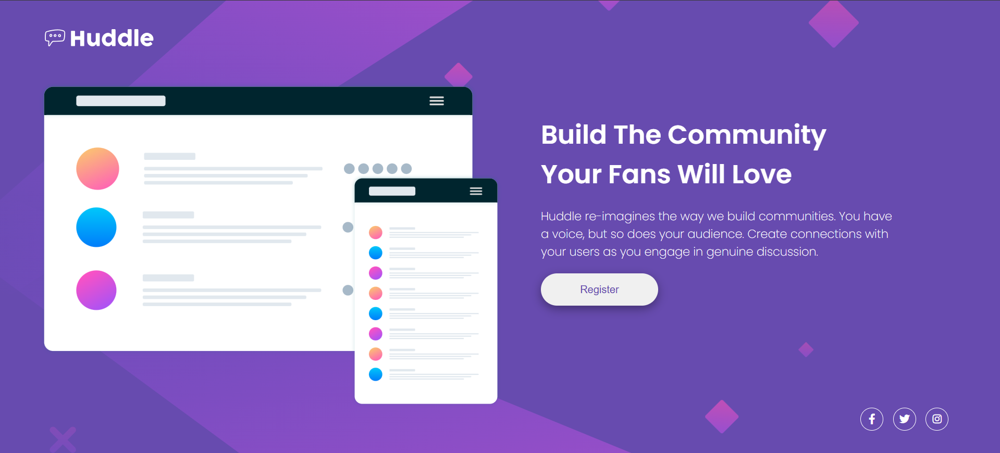
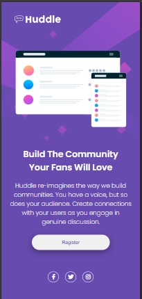

# Quest HTML + CSS Avançado - Curso DevEmDobro/FrontendMentor

## Tabela de Conteúdo

  - [Screenshot](#screenshot)
  - [Links](#links)
  - [Construído com ](#construído-com)
  - [Meu processo](#meu-processo)
  - [O que eu aprendi](#o-que-eu-aprendi)
  - [Autor](#autor)

### Screenshot





### Links

- Live Site URL: [https://lorrana-gm.github.io/projeto-huddle/](https://lorrana-gm.github.io/projeto-huddle/)

### Construído com 

- Marcação HTML5 semântica
- Propriedades personalizadas de CSS 
- Flexbox

### Meu processo

Primeiramente comecei identificando os elementos da página, para facilitar na construção do HTML, depois de construir o HTML passei para os estilos da página no CSS. 

Após terminado os estilos, passei para o responsivo para telas mobile como pedido no desafio, utilizando media query.

Por último fui comparando os códigos dos estilos.css com o responsivo.css para refatoração, retirando códigos desnecessários nos documentos.

### O que eu aprendi

Como ainda sou inciante, tive muita dificuldade em posicionar elementos na tela de vizualização, então foi onde eu passei mais tempo estudando como eu poderia posicioná-los utilizando os conceitos de flexbox. 

Esse desafio conseguiu me ajudar a reforçar esses conceitos, por exemplo, o que é provavelmente o mais utilizado: ```justify-content: center;```, ```align-items: center;``` servem para posicionar os elementos no centro da tela e para que funcionem é necessario que o conteúdo onde os elementos se encontram tenha uma largura e altura pré definidas.

## Autor

- Frontend Mentor - [@lorrana-gm](https://www.frontendmentor.io/profile/lorrana-gm)
